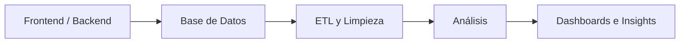

# ¡Hola! Soy Raúl Tovar

### Analista de Datos Junior | Desarrollador Web

---

## Sobre mí

Soy un **Analista de Datos Junior** con formación en ingeniería y experiencia previa como **Desarrollador Web**.

Combino programación, bases de datos y análisis de datos para transformar información en soluciones útiles y accionables. Mi experiencia en desarrollo web me permite comprender el ciclo completo del dato:

📌 Me enfoco en:

* Construcción de dashboards estratégicos y KPIs.
* Automatización de procesos ETL y reportes.
* Limpieza y análisis exploratorio de datos.
* Optimización de consultas SQL y flujos de información.
* Toma de decisiones basada en datos.

---

# 🛠️ Tech Stack

### Lenguajes

### Data Analytics

 

### ⚙️ Herramientas

---

# 📌 Proyectos Destacados  

## ETL para Monitoreo Académico

- Automatización de reportes desde archivos Excel usando **Python, Pandas y Schedule**.
- Reducción del tiempo de procesamiento manual en un **70%**.
- Limpieza y consolidación automática de información académica.

---

## Módulo de Reportes para Tarificador

- Desarrollo de dashboards interactivos con **Google Charts**.
- Consultas SQL optimizadas para reportes dinámicos.
- Reducción del tiempo de generación de informes en un **40%**.

---

# 🎯 Objetivo Profesional

Busco desarrollarme en áreas de:

* Data Analytics
* Business Intelligence
* Automatización de procesos
* ETL y transformación de datos
* Visualización y storytelling con datos

---

# 📫 Contacto

📧 **[raul.tovarv@gmail.com](mailto:raul.tovarv@gmail.com)**

---

  <i>“De construir sistemas a analizar los datos que los alimentan.”</i> 
  <i>Enfocado en generar valor mediante datos limpios y visualizaciones claras.</i>

